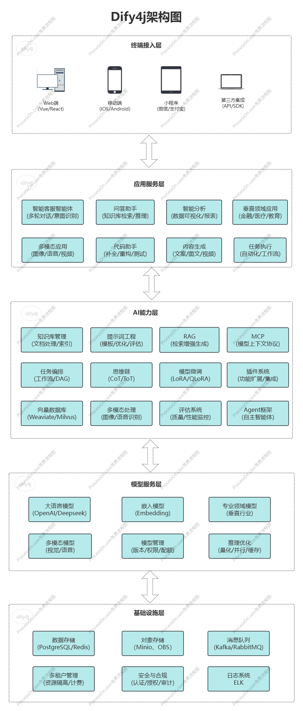

# Dify4j

Dify4j 是一个基于 Spring AI 的ToB企业级 AI 应用开发平台，提供了完整的 AI 应用生命周期管理，包括应用创建、模型管理、知识库管理、工作流编排、插件等从底层模型到终端应用的全栈解决方案功能。

该项目是 [Dify](https://dify.ai) 的 Java 实现版本，在保持核心功能一致的同时，更加注重企业级特性、多租户架构和国产化适配，适合对Java技术栈有偏好或需要更强企业级支持的组织使用。

## 在线体验

地址：http://42.194.189.63/

用户名/密码:admin/Yonchain

## 架构图



## 功能特点

- **多租户架构**：支持多租户隔离，每个租户拥有独立的资源和配置
- **应用管理**：创建、配置和部署 AI 应用
- **模型管理**：集成多种 AI 模型，支持模型的配置和调用
- **工具管理**：工具可以扩展 LLM 的能力
- **知识库管理**：构建和管理知识库，支持文档导入和检索
- **工作流编排**：可视化编排 AI 工作流，实现复杂的业务逻辑
- **安全认证**：基于 OAuth2 的认证和授权机制，保障系统安全
- **插件管理**：接入第三方模型与工具，显著提升应用能力
- **API 集成**：提供丰富的 API 接口，方便与其他系统集成

由于研发需要不少的时间成本和人力成本，现第一阶段里面的大部分功能是通过免登录集成Dify实现。
Dify4j集成Dify很简单，只要能连接Dify的数据库即可，可以无侵入快速集成不同版本的Dify,将耦合度降到最低。

## 技术栈

- **Java 17**：利用新的 Java 特性
- **Spring Boot 3.5.0**：提供快速开发和自动配置
- **Spring AI 1.0.0**：Spring 官方 AI 集成框架
- **PostgreSQL**：可靠的关系型数据库
- **Redis**：高性能缓存
- **MyBatis**：增强的 ORM 框架
- **Spring Security**：安全框架，提供认证和授权
- **Spring Doc**：API 文档生成

## 与Dify对比

Dify4j与原始的Dify项目在技术栈、功能实现和部署方式等方面存在一些差异：

| 特性        | Dify4j                              | Dify                      |
|-----------|-------------------------------------|---------------------------|
| **编程语言**  | Java 17                             | Python 3.10+              |
| **Web框架** | Spring Boot Web 3.5.0               | FastAPI                   |
| **AI框架**  | Spring AI 1.0.0                     | LangChain                 |
| **数据库**   | PostgreSQL                          | PostgreSQL                |
| **缓存**    | Redis                               | Redis                     |
| **向量数据库** | 支持Weaviate、Milvus、OpenSearch、Qdrant | 支持Weaviate、Milvus、Qdrant等 |
| **前端技术**  | Vue3 + TypeScript                   | React + TypeScript        |
| **多租户**   | 原生支持(默认禁用)                          | 需要定制                      |
| **国产化适配** | 支持国产数据库、中间件                         | 有限支持                      |
| **部署方式**  | Docker、源码部署                         | Docker、源码部署               |
| **API兼容性** | 兼容Dify API                          | 原生API                     |
| **插件生态**  | 支持Spring生态插件                        | 支持Python生态插件              |
| **工作流编排** | 可视化编排                               | 可视化编排                     |
| **知识库管理** | 支持多种文档格式                            | 支持多种文档格式                  |
| **模型支持**  | 支持主流LLM模型                           | 支持主流LLM模型                 |
| **安全认证**  | OAuth2 + Spring Security            | JWT + FastAPI安全机制         |
| **企业级特性** | 更多企业级功能和安全特性                        | 基础企业功能                    |
| **应用权限**  | 支持                                  | 不支持                       |
| **信创**    | 支持                                  | 不支持                       |

## 项目结构

Dify4j 采用模块化设计，主要包含以下模块：

- **dify4j-api**：API 定义和接口
- **dify4j-app**：AI应用管理
- **dify4j-bootstrap**：程序启动模块
- **dify4j-bom**：依赖版本管理
- **dify4j-client**：客户端库
- **dify4j-commons**：通用工具类和组件
- **dify4j-console**：控制台界面
- **dify4j-core**：核心功能
- **dify4j-idm**：身份和访问管理
- **dify4j-model**：模型定义和实现
- **dify4j-rag**：检索增强生成
- **dify4j-security**：安全相关功能
- **dify4j-spring-boot-autoconfigure**：Spring Boot 自动配置
- **dify4j-spring-boot-starters**：Spring Boot 启动器
- **dify4j-workflow**：工作流管理

## 快速开始

### 环境要求

#### 源码部署
- JDK 17 或更高版本
- Maven 3.6 或更高版本
- PostgreSQL 12 或更高版本
- Redis 6 或更高版本

#### Docker部署
- Docker 20.10 或更高版本
- Docker Compose 2.0 或更高版本

### 安装步骤

#### 源码部署

1. 克隆仓库

```bash
git clone https://github.com/yonchain/dify4j.git
cd dify4j
```

2. 配置数据库

创建 PostgreSQL 数据库，并更新 `dify4j-bootstrap/src/main/resources/application.yaml` 中的数据库配置：

```yaml
spring:
  datasource:
    url: jdbc:postgresql://localhost:5432/dify
    username: your_username
    password: your_password
```

3. 配置 Redis

更新 `dify4j-bootstrap/src/main/resources/application.yaml` 中的 Redis 配置：

```yaml
spring:
  data:
    redis:
      host: localhost
      port: 6379
      password: your_password
```

4. 编译项目

```bash
mvn clean install
```

5. 运行应用

```bash
java -jar dify4j-bootstrap/target/dify4j-bootstrap-1.0.0.jar
```

应用将在 `http://localhost:8080` 启动。

#### Docker部署(未支持)

1. 克隆仓库

```bash
git clone https://github.com/yonchain/dify4j.git
cd dify4j/dify4j-docker
```

2. 配置环境变量

复制环境变量模板文件并修改配置：

```bash
cp .env.example .env
```

编辑`.env`文件，配置以下关键参数：
- `DB_USERNAME`: PostgreSQL数据库用户名
- `DB_PASSWORD`: PostgreSQL数据库密码
- `REDIS_PASSWORD`: Redis密码
- `VECTOR_STORE`: 向量数据库类型(weaviate/milvus/opensearch)
- `STORAGE_TYPE`: 存储类型(local/s3/azure)

3. 启动服务

```bash
docker compose up -d
```

4. 访问应用

应用将在 `http://localhost` 启动。

5. 数据持久化

Docker部署默认会将以下数据持久化：
- PostgreSQL数据存储在`./data/postgres`目录
- Redis数据存储在`./data/redis`目录
- 上传文件存储在`./storage`目录

#### 中间件部署(开发环境)

如果需要单独部署中间件服务(数据库、Redis等)用于开发：

```bash
docker compose -f docker-compose.middleware.yaml --profile weaviate -p dify up -d
```

### 创建Docker代理容器连接Dify数据库

如果你使用的是Docker部署Dify，可以使用此方式

#### 创建共享网络

```bash
docker network create pg_network
```

#### 将原容器连接到新网络（不中断服务）

```bash
docker network connect pg_network dify数据库容器名称或ID
```

#### 创建代理容器

```bash
docker run -d --name pg_proxy \
  --network pg_network \
  -p 5432:5432 \
  alpine/socat \
  TCP-LISTEN:5432,fork TCP:dify数据库容器名称或ID:5432
```

#### 完成测试
命令的方式
```bash
psql -h localhost -p 5432 -U <用户名> -d <数据库名>
```
#### 如果连接数据库提示没有权限

进入到docker容器内开通权限
```bash
docker exec -it 容器id /bin/bash
cd /var/lib/postgresql/data

chmod -R 777 *
```

## API 文档

API 文档使用 SpringDoc 生成，可以通过访问 `http://localhost:8080/swagger-ui.html` 查看。

## 联系我们

### 作者微信


### 微信交流群

加群步骤

1.Star项目
2.扫作者微信二维码添加作者
3.将Star的截图发给作者
4.作者拉你进Star用户交流群

## 贡献指南

我们欢迎任何形式的贡献，包括但不限于：

- 提交 bug 报告
- 改进文档
- 提交功能请求
- 提交代码修复或新功能

请遵循以下步骤：

1. Fork 项目
2. 创建您的特性分支 (`git checkout -b feature/amazing-feature`)
3. 提交您的更改 (`git commit -m 'Add some amazing feature'`)
4. 推送到分支 (`git push origin feature/amazing-feature`)
5. 打开一个 Pull Request

## 许可证

本项目采用 Apache License 2.0 许可证 - 详情请参阅 [LICENSE](LICENSE) 文件。

## 联系方式

如有任何问题或建议，请通过以下方式联系我们：

- 项目负责人：[Yonchain](mailto:hongkong92@163.com)
- 项目主页：[GitHub](https://github.com/yonchain/dify4j.git)

---

Dify4j - 让 AI 应用开发更简单
